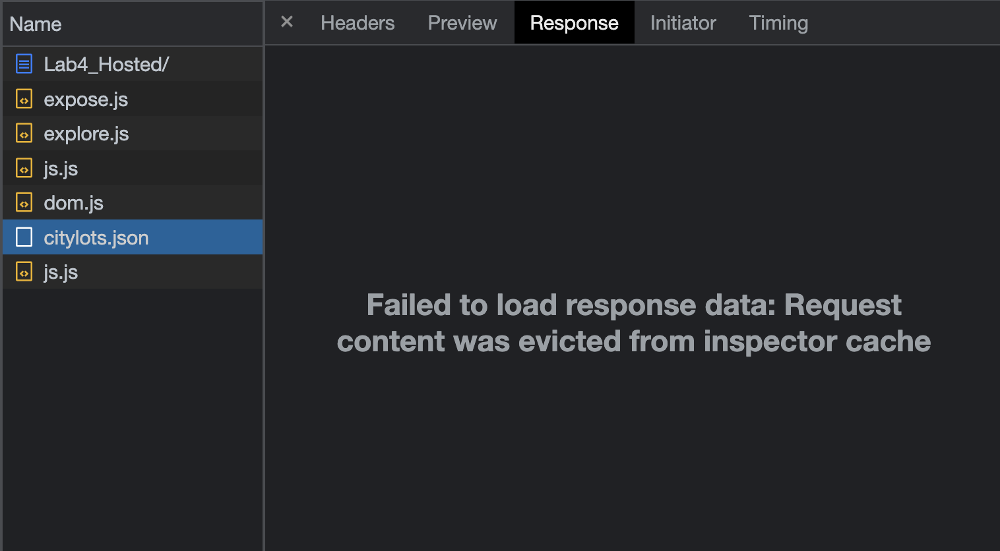

# Answers

Once it finishes downloading, answer the following questions:

1. What is the name of the new json file?
   
   `citylots.json`

2. Which file initiated the download of the new file?
   
   `expose.js`

3. What is its file size?
   
   779 kB

4. How long did it take to download?
   
   83 ms

Next, select that file to bring up a new side panel to answer the following:

1. What was your User-Agent for the browser that made the request?
   
   Mozilla/5.0

2. In the response header, what type of server did it come from?
   
   For some reason it said that it failed to load, and did not work even after multiple attempts.
   

3. When was the file last modified?
   
   Thu, 15 Sep 2022 22:44:30 GMT

4. What was the Content-Type of the file?
   
   `application/json; charset=utf-8`

Navigate to the Initiator tab now and answer the last question

1. Which function inside the initiating file made the request?
   
   The `fetchData` function.